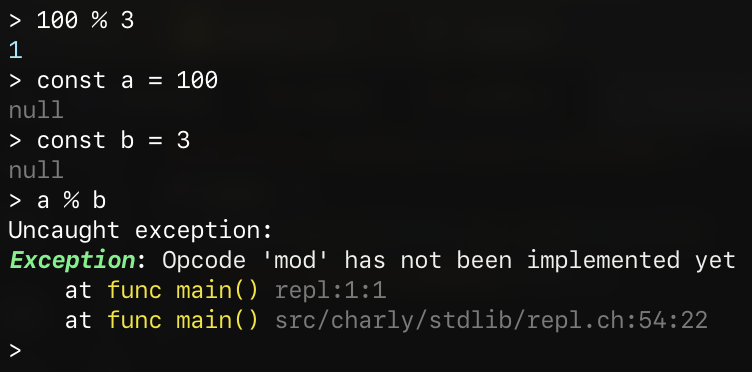

# Advent of Code 2025 in Charly
## Day 1

[Back to the main article](../)

Today's challenge involved determining the final dial position, given a series of turn descriptions.
The second part had me modify the solution, to instead determine how many times the dial clicked past the
`0` position.

<iframe frameborder="0" scrolling="no" style="width:100%; height:536px;" allow="clipboard-write" src="https://emgithub.com/iframe.html?target=https%3A%2F%2Fgithub.com%2FKCreate%2Fadvent-of-code-2025-charly%2Fblob%2Fmain%2Fdays%2Fday1%2Fday1.ch&style=github-dark&type=code&showLineNumbers=on&showFileMeta=on&showCopy=on&maxHeight=500"></iframe>

## Changes to the stdlib / VM

Today's challenge exposed a lot of shortcomings, notably the lack of any string processing capabilities.
Additionally, [for some reason](https://c.tenor.com/7v_rJ1xrFJ4AAAAC/tenor.gif),
the remainder (`%`) operator wasn't implemented yet.
I stumbled over this fact while experimenting with the REPL interface of the language.
Computing the remainder of two constants worked just fine, but threw an exception when actual variables were involved.

It turned out that my AST optimizing pass understands how to constant-fold remainder-operations, but the actual
VM didn't. I quickly added the missing opcode and the error went away.

The full set of changes can be found in the following commits

- [`264a8e2`](https://github.com/KCreate/charly-vm/commit/264a8e2b72f05839d3a2d08125afe6912756f7cc) `Implemented a readfile function`
- [`640313a`](https://github.com/KCreate/charly-vm/commit/640313a5250668ab55b2474ed9287229278b36a6) `Shebang support`
- [`617020b`](https://github.com/KCreate/charly-vm/commit/617020b397f37c30dacc61ecb5d0a5bc73e5d825) `String::split, String::substring, String::index_of`
- [`5f412a4`](https://github.com/KCreate/charly-vm/commit/5f412a424b3fbd58d7f8bb42764f9b519a1b549c) `Added String::to_number`
- [`86fec8b`](https://github.com/KCreate/charly-vm/commit/86fec8b49af454420ac61307447c687edd6c77ff) `Implemented mod (%) opcode`
- [`f0405b7`](https://github.com/KCreate/charly-vm/commit/f0405b7a2f5ce76bac9643c553b28a6d52958d07) `Implemented Number::floor`

[My apprentice](https://c.tenor.com/BCDXrDUayDAAAAAC/tenor.gif) at work [@HartoMedia](https://github.com/HartoMedia) implemented a `getenv` builtin method which
allows you to read a value from the process environment variables.

- [`9a3beea`](https://github.com/KCreate/charly-vm/commit/9a3beea141696331b359b90fcd2c154ee9c30d9a) `Implemented getenv builtin function`

## Links

- [Charly Programming Language](https://github.com/KCreate/charly-vm)
- [Source code for today's challenge](https://github.com/KCreate/advent-of-code-2025-charly/blob/main/days/day1/day1.ch)
- [Matthias Hartwig - @HartoMedia](https://github.com/HartoMedia)
- [Switzerlands Apprenticeship System](https://www.swissinfo.ch/eng/politics/apprenticeship-system/43796482)
