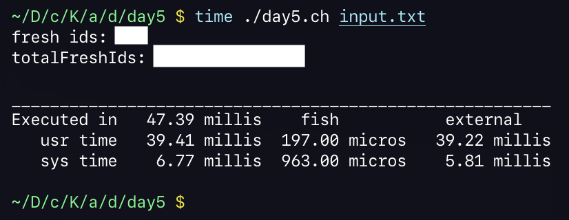

# Advent of Code 2025 in Charly
## Day 5

- [Back to the main article](../)
- [Previous day](../day4) - [Next day](../day6)

> This article is part of my series on implementing each Advent of Code 2025 challenge in my own
> programming language Charly.

Today's challenge asked to determine how many fresh ingredients the elves had in their warehouse.
Their inventory management system stores its data in the following format:

```
3-5
10-14
16-20
12-18

1
5
8
11
17
32
```

The file is split into two sections, separated by an empty line. The first section stores the inclusive ranges of
ingredient IDs that are considered fresh. The second section stores which ingredient IDs are actually in the warehouse.
The fresh ranges can overlap, but an ingredient ID is considered fresh if it falls into *any* fresh range.

For example, given the above information, ingredient ID `1` is *spoiled* since it does not fall into any range.
Ingredient ID `5` is *fresh* beacuse it falls into range `3-5`.
Ingredient ID `17` is *fresh* because it falls into range `16-20` as well as range `12-18`.

The first part of the challenge asked how many of the available ingredient IDs are fresh.
I solved this by checking if the ID was contained in at least one fresh range. Simple.

The second part of the challenge was more complicated. It asked to determine, based on the fresh ranges provided,
how many ingredient IDs *in total* could be considered fresh, no matter if they're actually present in the warehouse or not.

My first naive attempt was to just sum up the length of all ranges, which obviously failed, since the ranges can overlap.
My second idea was to store a list, with enough capacity to store a single item for each possible ingredient ID.
For the above example this would've worked well, but the actual validation dataset had numbers in the trillions,
which would've required `petabytes` of memory. I do not have `petabytes` of memory in my machine. So that option was out.

I finally converged on the idea of preprocessing the ranges first, eliminating any overlaps.
I kept a queue of ranges that I still had to process, and a list of processed non-overlapping ranges.
For each unprocessed range, I determined if it overlapped an already processed one.
If it did, I would discard the overlapping parts and re-queue the non-overlapping ones.

I then processed the range queue entries until there were no more overlapping ranges.
After that I could simply sum up the lengths of the individual non-overlapping ranges to get the final answer.



> On my machine, Charly took about `48` milliseconds to compute the solutions for today's challenge.

Find my solution below:

```javascript
#!/usr/local/bin/charly

if ARGV.length < 2 {
  print("Missing filepath")
  exit(1)
}

const input_path = ARGV[1]
const input = readfile(input_path)

const lines = input.lines()

const emptyLineIndex = lines.find("")

const freshIdRanges = lines
    .sublist(0, emptyLineIndex)
    .map(->(range) {
        range
            .split("-")
            .map(->(num) num.to_number())
    })

const availableIds = lines
    .sublist(emptyLineIndex + 1)
    .map(->(num) num.to_number())

func isFresh(id) {
    return freshIdRanges.any(->(range) {
        const (start, end) = range
        return id >= start && id <= end
    })
}

const freshIds = availableIds.filter(->(id) isFresh(id))

print("fresh ids: {freshIds.length}")

const rangesToProcess = freshIdRanges.copy()
const trimmedRanges = []
while (rangesToProcess.notEmpty()) {

    const newRange = rangesToProcess.pop()
    const (start, end) = newRange

    // ignore invalid ranges
    if !(start <= end) {
        continue
    }

    // case: new range fully encompasses existing range
    if trimmedRanges.any(->(existing) {
        const (otherStart, otherEnd) = existing
        if otherStart >= start && otherEnd <= end {
            const (leftStart, leftEnd) = (start, otherStart - 1)
            const (rightStart, rightEnd) = (otherEnd + 1, end)

            // queue the new subranges
            rangesToProcess.push((leftStart, leftEnd))
            rangesToProcess.push((rightStart, rightEnd))

            return true
        }

        return false
    }) {
        continue
    }

    // new range overlaps existing range
    if trimmedRanges.any(->(existing) {
        const (otherStart, otherEnd) = existing
        const startOverlap = start >= otherStart && start <= otherEnd
        const endOverlap = end >= otherStart && end <= otherEnd

        if startOverlap || endOverlap {
            rangesToProcess.push((start, otherStart - 1))
            rangesToProcess.push((otherEnd + 1, end))
            return true
        }

        return false
    }) {
        continue
    }

    // new range does not overlap any existing range, can add to trimmed set
    trimmedRanges.push(newRange)
}

const totalFreshIds = trimmedRanges.reduce(0, ->(acc, range) {
    const (start, end) = range
    const rangeLength = end - start + 1
    acc + rangeLength
})

print("totalFreshIds: {totalFreshIds}")
```

## Changes to the stdlib / VM

Standard library methods I added:

- `String::lines`: Returns all lines of the string as a list. This is a convenience method that just calls `split` with a newline separator
- `List::find`: Returns the index of the first list entry that matches the argument
- `List::findBy`: Returns the index of the first list entry for which the provided callback returns true
- `List::first`: Returns the first element of the list, or null if the list is empty
- `List::last`: Returns the last element of the list, or null if the list is empty

Methods I had to modify:

- `String::split`: Now also includes empty elements in between separators. Since this method was implemented in native code, this involved modifying and recompiling the `charly` binary.

You can find the individual commits below:

- [`b800a1c`](https://github.com/KCreate/charly-vm/commit/b800a1cded25d66689d9df39ffcd24474ce12ae3) `String::split include empty parts`
- [`c63c183`](https://github.com/KCreate/charly-vm/commit/c63c1838a869ba4f6eafeb5b892cea3ef7c887bb) `Add String::lines`
- [`030b065`](https://github.com/KCreate/charly-vm/commit/030b065363480a42fe203d9839a71b3a3c846794) `Trim empty last line in String::lines`
- [`bac6344`](https://github.com/KCreate/charly-vm/commit/bac6344262ca360e21ab49c6c6a3a7eaedd2cd86) `Add List::findBy and List::find`
- [`b79de83`](https://github.com/KCreate/charly-vm/commit/b79de83629186f61844bf62c8f4d6fd34ab2608c) `Add List::first and List::last`

## Addendum

After discussing my solution with some of my colleagues and friends,
I realized there’s a much simpler way to solve today’s puzzle.
My original approach had unnecessary complexity because I didn’t sort the list of ranges before processing them.
If you do sort them, you can simply iterate over the ranges from
left to right and merge adjacent ranges if they overlap.

I’ve implemented this approach in Charly as well, you can find the code below:

```javascript
// ... previous code same as above ...

const (firstRange, ...remainingRanges) = freshIdRanges
    .sort(->(left, right) left[0] <=> right[0])

const mergedRanges = [firstRange]

remainingRanges.each(->(range) {
    const (newStart, newEnd) = range
    const (lastStart, lastEnd) = mergedRanges.last()

    if newStart <= lastEnd + 1 {
        const merged = (lastStart, newEnd.max(lastEnd))
        mergedRanges[mergedRanges.length - 1] = merged
    } else {
        mergedRanges.push(range)
    }
})

const totalFreshIds = mergedRanges.reduce(0, ->(acc, c) {
    const (start, end) = c
    const length = end - start + 1
    acc + length
})

print("total fresh ids: {totalFreshIds}")
```

## Links

- [Advent of Code](https://adventofcode.com/)
- [Charly Programming Language](https://github.com/KCreate/charly-vm)
- [Source code for today's challenge](https://github.com/KCreate/advent-of-code-2025-charly/blob/main/days/day5/day5.ch)
