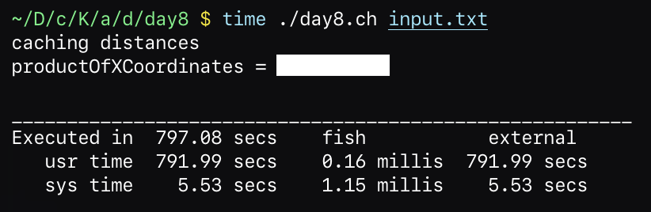
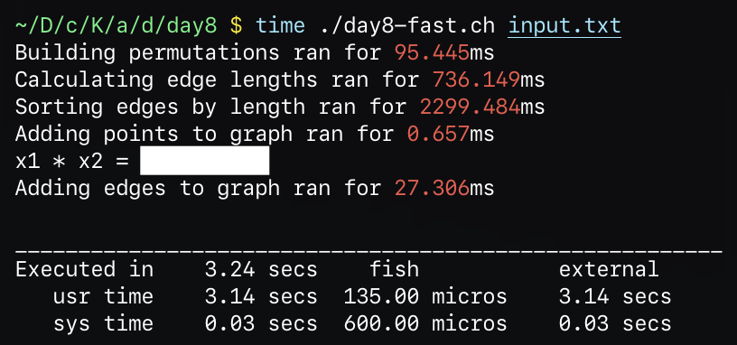

# Advent of Code 2025 in Charly
## Day 8

- [Back to the main article](../)
- [Previous day](../day7) - [Next day](../day9)

> This article is part of my series on implementing each Advent of Code 2025 challenge in my own
> programming language Charly.

## Puzzle

> I won't cover my solution to part 1 of the puzzle today, instead I'll quickly describe the puzzle and
> then go into more detail about the challenges I've faced.

Today's puzzle involved a lot of number crunching! The elves needed help decorating their
underground playground, which they rigged many small electrical junction boxes.

Their plan is to connect the junction boxes with long strings of lights.
The elves are trying to figure out which junction boxes to connect so that electricity can
reach every junction box.

You are given a list of all the junction boxes' positions in 3D space.
For example:

```
162,817,812
57,618,57
906,360,560
592,479,940
352,342,300
466,668,158
542,29,236
431,825,988
739,650,466
52,470,668
216,146,977
819,987,18
117,168,530
805,96,715
346,949,466
970,615,88
941,993,340
862,61,35
984,92,344
425,690,689
```

Each line contains the `X,Y,Z` coordinates of a single junction box.
To save on string lights, the elves would like to focus on connecting pairs of
junction boxes that are **as close togther as possible**, according to their straight-line euclidian distance.
Junction boxes connected by a string of lights form a `circuit`.
If a junction box is connected to another junction box which is already part of a circuit, that circuit
grows to now also include the newly connected junction box.

Part 1 asked to connect the `1000` pairs of junction boxes which are closest together,
and to then determine the `product` of the three largest circuits' sizes.

Part 2 asked how many pairs of junction boxes must be connected before all junction boxes
form a single circuit.

## Implementation - Attempt 1

Implementing today's puzzle *in Charly* was challenging.

Because Charly lacks any kind of `HashTable`, `Set` or `Graph` types,
I had to implement everything with the only sensible data structure I had available: the humble `List`.
This meant a *lot* of iterating over lists.

Because of some poor algorithm choices and me not sorting the input data before processing it,
this version ran *extremely* slow.



> Calculating the solution took about **`13` minutes** on my machine.

While this allowed me to complete the puzzle and submit my solutions, it bugged me throughout the day.

> Note: My initial version already contained some optimizations, mostly caches here and there.
> While I never actually fully executed the version without the caches, I assume it would have run
> for far longer than *just* `13` minutes.

Below is my initial solution to the puzzle:

```javascript
const input_path = ARGV[1]
const lines = readfile(input_path).lines()

const positions = lines.map(->(line) {
    line.split(",").map(->(n) n.to_number())
})

class Graph {
    property nodes = []
    property edges = []
    property groups = []
    property distanceFn = null
    property cached_node_distances = []
    property cached_node_outgoing_edges = []

    func constructor(@distanceFn) {}

    func cache_distances {
        const permutations = []
        nodes.each(->(n1, i1) {
            nodes.each(->(n2, i2) {
                if i1 != i2 {
                    permutations.push((i1, i2))
                }
            })
        })

        @cached_node_distances = List.create_with(@nodes.length, ->{
            List.create(@nodes.length)
        })

        permutations.map(->(permutation) {
            const (i1, i2) = permutation
            const distance = @distance_between(i1, i2)

            // [distance, isConnected]
            @cached_node_distances[i1][i2] = [distance, false]
        })
    }

    func add_node(node) {
        @nodes.push(node)
        @cached_node_outgoing_edges.push([])
    }

    func add_edge(id1, id2) {
        @edges.push((id1, id2))
        @edges.push((id2, id1))
        @cached_node_distances[id1][id2][1] = true
        @cached_node_distances[id2][id1][1] = true
        @cached_node_outgoing_edges[id1].push(id2)
        @cached_node_outgoing_edges[id2].push(id1)
    }

    func in_same_group(i1, i2) {
        const groupOf1 = @groups.find(->(group) group.contains(i1))
        const groupOf2 = @groups.find(->(group) group.contains(i2))
        if groupOf1 == null || groupOf2 == null return false
        groupOf1 == groupOf2
    }

    func update_groups() {
        @groups.clear()

        // [ [node, hasBeenVisited] ]
        const workList = @nodes.map(->(node, index) [node, index, false])

        loop {

            // find the first entry that hasn't been visited yet
            const unvisited = workList
                .filter(->(entry) {
                    const (node, index, isVisited) = entry
                    !isVisited
                })
                .first()
            if unvisited == null {
                break
            }
            const unvisitedIndex = unvisited[1]

            // find all connected nodes
            const visitQueue = [unvisitedIndex]
            const groupIds = []
            while visitQueue.notEmpty() {
                const id = visitQueue.pop()

                // item already visited
                if (workList[id][2]) {
                    continue
                }

                // mark as visited
                workList[id][2] = true
                groupIds.push(id)

                // collect neighbours
                const neighbours = get_connected_nodes(id)
                neighbours.each(->(neighbourId) {
                    visitQueue.push(neighbourId)
                })
            }

            @groups.push(groupIds)
        }
    }

    func get_connected_nodes(id) {
        @cached_node_outgoing_edges[id]
    }

    func has_edge(id1, id2) {
        const v1 = id1.min(id2)
        const v2 = id1.max(id2)
        @edges.find((v1, v2)) >= 0
    }

    func distance_between(id1, id2) {
        const node1 = @nodes[id1]
        const node2 = @nodes[id2]
        @distanceFn(node1, node2)
    }

    func find_shortest_unconnected_edge() {
        let shortestEdge = null
        let shortestDistance = null

        @cached_node_distances.each(->(row, i1) {
            row.each(->(entry, i2) {
                if entry == null {
                    return
                }
                const (distance, isConnected) = entry
                if isConnected {
                    return
                }

                if shortestDistance == null || distance < shortestDistance {
                    shortestEdge = (i1, i2)
                    shortestDistance = distance
                }
            })
        })

        shortestEdge
    }
}

func vectorDistance(a, b) {
    const (x1, y1, z1) = a
    const (x2, y2, z2) = b

    const (dx, dy, dz) = (
        (x1 - x2).abs(),
        (y1 - y2).abs(),
        (z1 - z2).abs()
    )

    (dx * dx + dy * dy + dz * dz).cbrt()
}

const g = Graph(vectorDistance)
positions.each(->(p) g.add_node(p))
print("caching distances")
g.cache_distances()

let i = 0
loop {
    const shortest_edge = g.find_shortest_unconnected_edge()
    if shortest_edge == null return
    const (i1, i2) = shortest_edge
    const n1 = g.nodes[i1]
    const n2 = g.nodes[i2]

    if !g.in_same_group(i1, n2) {
        g.add_edge(i1, i2)
        g.update_groups()
    }

    if g.groups.length == 1 {
        print("productOfXCoordinates = {n1[0] * n2[0]}")
        break
    }

    i += 1
}

```

## Implementation - Attempt 2

I knew I just had to try again. The key thing I had to improve was the algorithm I used to keep track
of point edges and the resulting groups. Let's walk through my final implementation together.

A key problem of my previous solution was the need to recalculate the point groups from scratch every time
a new edge was added to the graph. Instead of keeping track of the edges, I now keep track of the groups
the points belong to.

```javascript
class PointGraph {
    property groups = []

    func constructor(points) {
        @groups = List.create_with(count, ->(i) [i, [i]])
    }

    // returns true if this edge caused two groups to be merged
    // returns false otherwise
    func add_edge(i1, i2) {

        // merge the groups for that id
        const (g1id, g1list) = self.groups[i1]
        const (g2id, g2list) = self.groups[i2]

        // check if they are already the same group
        if g1id == g2id {
            return false
        }

        const newGroupMemberList = g1list.concat(g2list)
        const newGroup = [g1id, newGroupMemberList]

        // update the group references of all points in this group
        newGroupMemberList.each(->(id) {
            self.groups[id] = newGroup
        })
        return true
    }
}
```

Each entry in the `groups` list contains
the group ID and the list of points that are part of that group. Before any edges are added
each point is in its own group.

Whenever a new edge is added, there are two options:

- The two points are already in the same group
- The two points are in separate groups

If the two points are already in the same group, nothing has to be done!

If the two points are in separate groups however, I merge those two groups together.
For each point in the new group, I replace the associated entry in the `groups` list with
a new entry, containing all points from both groups.

Let's walk through how this data structure is used to determine the solution.

The first step is to parse the input file and store the points in a list of coordinates.

```javascript
const points = lines
    .map(->(line) {
        line.split(",").map(->(s) s.to_number())
    })
```

I then determine the list of possible edges between all points.
This is achieved by iterating over all points in two nested loops.
The loop indexes are chosen so that the edge list does not contain
any undirected duplicates or self-loops.

```javascript
const edges = List
    .build(->(list) {
        let length = points.length
        let i = 0
        let j = 1

        while i < length {
            while j < length {
                list.push((i, j))
                j += 1
            }
            i += 1
            j = i + 1
        }
    })
```

I then calculate the distance of each edge and store them, together with the edge, in a new list.

```javascript
const edgeDistancePairs = edges
    .map(->(edge) {
        const (i1, i2) = edge
        const (x1, y1, z1) = points[i1]
        const (x2, y2, z2) = points[i2]
        const (dx, dy, dz) = (
            (x1 - x2).abs(),
            (y1 - y2).abs(),
            (z1 - z2).abs()
        )
        const distance = (dx * dx + dy * dy + dz * dz).sqrt()
        (edge, distance)
    })
```

That list is then sorted, based on the distance.

```javascript
const sortedEdges = edgeDistancePairs
    .sort(->(a, b) {
        const (e1, d1) = a
        const (e2, d2) = b
        d1 - d2
    })
    .map(->(edgeDistancePair) edgeDistancePair[0])
```

Finally, I construct a `PointGraph` instance with enough space to represent all points parsed from the input file.
I then create a queue of edges to add by reversing the `sortedEdges` list.
That way I can cleanly pop them off from the end.
Alternatively I could have reversed the sort order above.
Because the implementation of `PointGraph::add_edge` tells me whether the edge resulted
in two groups being merged, I can accurately keep track of the total amount of groups in the graph
without having to inspect the data structure itself.

```javascript
const graph = PointGraph(points.length)
const queue = sortedEdges.reverse()
let group_count = points.length
loop {
    const edge = queue.pop()
    const (i1, i2) = edge
    const did_merge_groups = graph.add_edge(i1, i2)

    // update group count if this edge merged two groups
    if did_merge_groups {
        group_count -= 1
    }

    // coallesced all groups, print the solution to the puzzle
    if group_count == 1 {
        const (p1, p2) = (points[i1], points[i2])
        const (x1, x2) = (p1[0], p2[0])
        print("x1 * x2 = {x1 * x2}")
        break
    }
}
```

Once a single group containing all the points in the graph has been reached I can extract
the `X` components of the points the last edge has connected and print the solution to the puzzle.

This implementation improved performance significantly!



> The new algorithm only takes about **`3` seconds** on my machine.

> The vast majority of the execution time is spent sorting the list of edges.
> I did attempt to parallelize the merge-sort implementation, but the overhead caused by
> contention and scheduling negated any performance benefits.
> The virtual machine holds a per-object lock whenever it modifies an object, or a list, which
> explains why this didn't result in the performance gains I expected.

Running the script with a profiler attached told me that the virtual machine spent
most of its' time looking up functions from class objects.
I could probably improve performance further by implementing an inline-caching system
and reusing the result of that expensive lookup.

Maybe another day...

## Changes to the stdlib / VM

To further improve performance, I replaced the default sorting algorithm in the standard library
with a [merge-sort implementation](https://github.com/KCreate/charly-vm/commit/dce5b7ae6488ab13971eadbcc7a6f43d58e43845).
Although I'd like to claim credit for this, I did task ChatGPT
with generating the implementation for this method.

Additionally, I extended the builtin `Math` module with the following methods:

- `sqrt` Return the square root of a number
- `cbrt` Return the cube root of a number
- `abs` Returns the absolute value of a number

Some other functionality I added:

- `String::hashcode` Implemented `hashcode` as a well-known property of `String` in the virtual machine
  It returns the CRC32 hash of the string.
  This value was already getting calculated by the virtual machine, which used it to improve performance for
  property or function lookups.
  This change exposes the hashcode to user code.
  I may use this in the future to implement a proper hash table
- `Stopwatch::section` Executes a callback and prints the execution time to the console
- `List::concat` Concatenates two lists
- `List::build` Copy of the kotlin `buildList` method. Creates a new list and allows a callback to initialize it

You can find the individual commits below:

- [`b025f9b`](https://github.com/KCreate/charly-vm/commit/b025f9b4bb1e76921fd3792a6f5ac11a4b481f0f) `Add Math::sqrt, Math::cbrt, Math::abs`
- [`96f2ac2`](https://github.com/KCreate/charly-vm/commit/96f2ac20e9f97b959e1c1ac1df8b66d5be8f71a7) `Add String::hashcode as well-known property`
- [`554c4df`](https://github.com/KCreate/charly-vm/commit/554c4df0444993981421ee925c2c8c6c9c7a6a3c) `Add Stopwatch::section`
- [`e88c07b`](https://github.com/KCreate/charly-vm/commit/e88c07b26c92f12df5ba6e215c992ece1df88f04) `Fix bug in List::clear`
- [`efd4079`](https://github.com/KCreate/charly-vm/commit/efd4079c0358d1f3ade51d64c436e135ab421956) `Add List::concat`
- [`b957bfe`](https://github.com/KCreate/charly-vm/commit/b957bfe08e0260decfef98e24fc37ccbb6457393) `Add List::build`
- [`dce5b7a`](https://github.com/KCreate/charly-vm/commit/dce5b7ae6488ab13971eadbcc7a6f43d58e43845) `Implemented merge sort in List::sort`

## Links

- [Advent of Code](https://adventofcode.com/)
- [Charly Programming Language](https://github.com/KCreate/charly-vm)
- [Source code for today's challenge](https://github.com/KCreate/advent-of-code-2025-charly/blob/main/days/day8)
